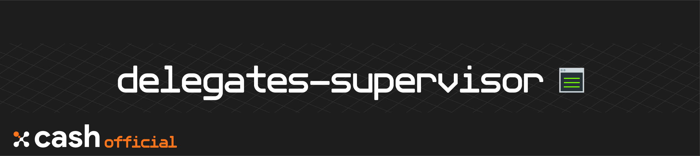

<div align=middle>

<a align="center" href="https://x-network.io/xcash"></a>

[](https://opensource.org/licenses/MIT)
[](https://discordapp.com/invite/4CAahnd)

</div>

# X-Cash Delegates Supervisor

👨‍💻 **Easy access to your statistics and information on the latest block creation**

*Admin-panel-styled dashboard forked from [cdk-admin](https://github.com/codetok/cdk-admin), an Angular 6 admin panel using angular material.*

## Table of Contents

- [Table of Contents](#table-of-contents)
- [Features](#features)
- [License](#license)
- [Contributing](#contributing)
- [Documentation](#documentation)
- [Security](#security)
- [Installation Process](#installation-process)
  - [Dependencies](#dependencies)
  - [Requirements](#requirements)
  - [Develop](#develop)
  - [Testing](#testing)
- [Installation Process LXC](#installation-process-lxc)
  - [Dependencies](#dependencies)
  - [Requirements](#requirements)
  - [Update Process](#update-process)
  - [Testing](#testing)

## Features

> This website is *optional* to run for solo delegates. It can be setup on a separate system than the `xcash-dpops` node as it's using API calls to the explorer.

**One-stop Dashboard**  
Have a quick view of the latest block creation and your delegate statistics.

## License

**The X-Cash Delegate Supervisor is an open-source project managed by the X-Cash Foundation**.  
We are operating under the [MIT License](LICENSE).

## Contributing

**Thank you for thinking of contributing! 😃**   
If you want to help out, check [CONTRIBUTING](https://github.com/X-CASH-official/.github/blob/master/CONTRIBUTING.md) for a set of guidelines and check our [opened issues](https://github.com/X-CASH-official/delegates-explorer/issues).

## Documentation

We are hosting our documentation on **GitBook** 👉 [**docs.xcash.foundation**](https://docs.xcash.foundation/)

> You can contribute directly on our [`gitbook-docs`](https://github.com/X-CASH-official/gitbook-docs) repository.

## Security

If you discover a **security** vulnerability, please send an e-mail to [security@xcash.foundation](mailto:security@xcash.foundation).  
All security vulnerabilities concerning the X-Cash blockchain will be promply addressed.

## Installation Process

### Dependencies

> The following table summarizes the tools and libraries required to run the delegates pool website.

| Dependencies | Min. version   | Ubuntu package                                                      |
| ------------ | -------------- | ------------------------------------------------------------------- |
| `Node.js`      | 8              | install from binaries                                               |
| `Angular`      | 6              | install from `npm`                                                    |
| `Nginx`  | any | `nginx` |


**If you want to run the website using SSL then you will need to install a webserver like nginx  
The readme shows you how to setup the website using HTTP, since there is no sensitive data in the website**

### Requirements

#### Installing NGINX
`sudo apt update && sudo apt install -y nginx`

#### Configure NGINX
NGINX is already configured for a single website once installed.

Just edit the nginx default configuration to enable subfolder:

```bash
sudo nano /etc/nginx/sites-available/default
```

Change
```bash
location / {
  # First attempt to serve request as file, then
  # as directory, then fall back to displaying a 404.
  try_files $uri $uri/ =404;
}
```
to
`
location / {
  # First attempt to serve request as file, then
  # as directory, then fall back to displaying a 404.
  try_files $uri $uri/ /index.html;
}
`

Now, you can copy the dist folder contents to `/var/www/html/` to install the website


#### Intalling Node.js from binaries

> It is recommended to install the nodejs folder in the home directory `/home/$USER/` or root directory (`/root/`) in a new folder

To download, go to the Node.js official [release page](https://nodejs.org/en/download/current/) and download the **Linux Binaries**. Copy it to your deisgnated folder and run these commands:

```bash
tar -xf node*.tar.xz
rm node*.tar.xz
```

Then add Node.js to your path:

```bash
echo -e '\nexport PATH=path_to_nodejs/bin:$PATH' >> ~/.profile && source ~/.profile
```
> Replace `path_to_nodejs/bin` with the location of the `bin` folder where you installed Node.js

#### npm

> Note if your installing on a `root` session, you need to run these additional commands before upgrading
> ```bash
> npm config set user 0
> npm config set unsafe-perm true
> ```

Update `npm` globally:
```bash
npm install -g npm
```

#### angular

Install the latest version of Angular globally:
```shell
npm install -g @angular/cli@latest
```

Then install the compressor `UglifyJS` globally :
```shell
npm install -g uglify-js
```

### Develop

#### Clone repository

In your desired folder, clone the repository:
```shell
git clone https://github.com/X-CASH-official/delegates-supervisor.git
```

#### Enable port 80 in the firewall

Uncomment these lines in `$HOME/firewall_script.sh`
```
# iptables -t filter -I INPUT -p tcp --syn --dport 80 -m connlimit --connlimit-above 100 --connlimit-mask 32 -j DROP
```

```
# iptables -A INPUT -p tcp --dport 80 -j ACCEPT
```

Run the firewall script  
`$HOME/firewall_script.sh`

#### Configure

Add your node wallet public address for the API calls:
```shell
nano delegates-supervisor/src/app/services/public_address.service.ts
```

Edit Line 7 from:

`PUBLIC_ADDRESS:string = ""`

to

`PUBLIC_ADDRESS:string = "<YOUR_NODE_WALLET_PUBLIC_ADDRESS>"`


#### Build

To build the delegates pool website, go to the `delegates-supervisor` folder and run:
```shell
npm run build
```

It will build in the `dist`folder.

Compress the `.js` files with `Uglify-JS` and move all of the contents of this folder to your `xcash-dpops/` folder

```shell
cd dist
for f in *.js; do echo "Processing $f file.."; uglifyjs $f --compress --mangle --output "{$f}min"; rm $f; mv "{$f}min" $f; done
cd ../
```

Copy the dist folders contents to the default nginx setup  
`cp -a dist/* /var/www/html/`

### Testing

```shell
npm test
```

To test that you have properly configured the delegates pool website, run `xcash-dpops` with the `--test_data_add` flag. *This will add test datas to the MongoDB.*

Now run the website server again using the normal options.

Next, navigate to your servers IP address or website domain. You should now see the website and some test data. You can navigate through the website using the test data.

When you have verified that the website works correctly, remove the test data by shutting down the `xcash-dpops` and then running it again with the `--test_data_remove` flag.

## Installation Process LXC

### Dependencies

> The following table summarizes the tools and libraries required to run the delegates explorer.

| Dependencies | Min. version   | Ubuntu package                                                      |
| ------------ | -------------- | ------------------------------------------------------------------- |
| `Node.js`      | 8              | install from binaries                                               |
| `Angular`      | 6              | install from `npm`                                                    |
| `nginx`                                  | latest version | install from script |

### Requirements

#### Update LXD

> LXD is a Linux Container system manager. Learn more [here](https://linuxcontainers.org/)

*You can install and update the website in a LXD/LXC container using the [`xcash-dpops`](https://github.com/X-CASH-official/xcash-dpops/tree/master#system-requirements) auto-installer.*

Check if LXD is installed:
```bash
lxd --version
```

If it displays a version, it is recommneded to uninstall it to update it manually. Run:
```bash
sudo apt remove -y --purge lxd lxd-client
```

Then reinstall the latest version:
```bash
sudo snap install lxd
```

Run the configuration for LXD and set the default selection to the configuration questions:

```bash
lxd init
```

> For the size of the new loop device **specify 80-90% of your disk space**. Your containers won't have an artifical low disk space limit.

#### Install from script

Run the `autoinstaller.sh` to install the website into a LXC/LXD container:

```bash
bash -c "$(curl -sSL https://raw.githubusercontent.com/X-CASH-official/delegates-supervisor/master/scripts/autoinstaller.sh)"
```

The website will be started in the LXC container.

<details><summary><strong>Container commands</strong></summary>

```bash
# Start the container  
lxc start container

# Stop the container  
lxc stop container

# Delete the container (The container must be stopped first)  
lxc delete container

# Open a terminal inside the container  
lxc exec container -- bash

# Exit the terminal  
exit

# List all running containers  
lxc list
```

</details>

#### Configure the container

You need to setup port forwarding on the container to route all traffic on `port 80` to the container.

Check the containers private IPV4 address:
```bash
lxc list
```

Then forward the ports to the containers private IP address:  
```bash
lxc config device add delegates-supervisor delegates-supervisor-80 proxy listen=tcp:PUBLIC_IP_OF_SERVER:80 connect=tcp:PRIVATE_IP_OF_CONTAINER:80
```

#### Remove proxy

```bash
lxc config device remove delegates-supervisor delegates-supervisor-80
```


### Update Process

Run the `autoinstaller.sh` on the host and choose the update mode:

```bash
bash -c "$(curl -sSL https://raw.githubusercontent.com/X-CASH-official/delegates-supervisor/master/scripts/autoinstaller.sh)"
```

### Testing

```bash
npm test
```
